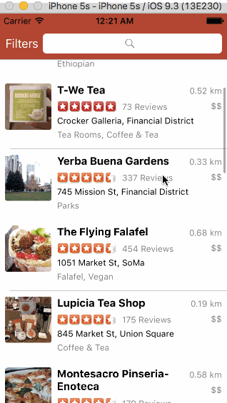

# Week 2 Project - Yelp

Yelp is an application for browsing, filtering and searching Yelp listings.

Submitted by: Andrew Duck

Time spent: 10 hours spent in total

## User Stories

The following **required** functionality is complete:

* [x] Table rows should be dynamic height according to the content height.
* [x] Custom cells should have the proper Auto Layout constraints.
* [x] Search bar should be in the navigation bar 
* [x] The filters you should actually have are: category, sort (best match, distance, highest rated), distance, deals (on/off).
* [x] The filters table should be organized into sections as in the mock.
* [x] You can use the default UISwitch for on/off states.
* [x] Clicking on the "Search" button should dismiss the filters page and trigger the search w/ the new filter settings.

The following **optional** features are implemented:

## Video Walkthrough 

GIF created with [LiceCap](http://www.cockos.com/licecap/).

## Notes

Couldn't make the keyboard disappear on search cancel action.  

## License

Copyright [2016] [Andrew Duck]

Licensed under the Apache License, Version 2.0 (the "License");
you may not use this file except in compliance with the License.
You may obtain a copy of the License at

http://www.apache.org/licenses/LICENSE-2.0

Unless required by applicable law or agreed to in writing, software
distributed under the License is distributed on an "AS IS" BASIS,
WITHOUT WARRANTIES OR CONDITIONS OF ANY KIND, either express or implied.
See the License for the specific language governing permissions and
limitations under the License.
